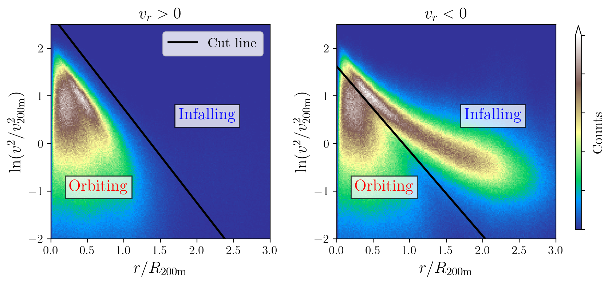

# Orbiting Mass Assignment Scheme

When using this code please cite Salazar et. al. (2025) ([arXiv:XXXX.XXXX]()).

- [Requirements](#requirements)
- [Installation](#installation)
- [Usage](#usage)
    - [User parameters](#user-parameters)
    - [Prepare data](#step-1-prepare-data)
    - [Calibration](#step-2-calibration)
    - [Running Oasis](#step-3-run-orbiting-mass-assingment)
- [Data products](#data-products)
    - [Halo catalogue](#dynamical-halo-catalogue)
    - [Members catalogue](#halo-members-catalogue)

## Requirements
Create a conda environment. An `environment.yml` file is supplied as an example but feel free to use your own. It must include `mpi4py` and `python>=3.10`.
```sh
$ conda env create -f environment.yml
```
Alternatively
```sh
$ conda create --name <env name> python=3.10 mpi4py
```

## Installation
Build from source
```sh
$ git clone https://github.com/edgarmsalazar/oasis.git
$ cd oasis
$ python -m pip install .
```

## Usage
A [template](template.py) file is provided as an example of how to use the code. It is very simple and it consists of three basic steps: preparing data, calibrating and running.

### User parameters
The choice of units is not strict to the ones shown below. However, it must be consistent across all quantities with the same physical dimensions. For example, if the units for the `boxsize` are in $h^{-1}{\rm Mpc}$, then all distances, positions and radii must also be provided in $h^{-1}{\rm Mpc}$.

- `boxsize`: side length of the simulation box in units of $h^{-1}{\rm Mpc}$.
- `minisize`: side length of the minibox or subvolume in units of $h^{-1}{\rm Mpc}$.
- `padding`: length of the padding distance form the edge of the minibox in units of $h^{-1}{\rm Mpc}$.
- `mass_density`: mass density of the Universe in units of $h^{-2} M_{\odot} / {\rm Mpc}^{3}$.
- `particle_mass`: dark matter particle mass in units of $h^{-2} M_{\odot}$.
- `save_path`: path to the directory where <span style="font-variant:small-caps;">Oasis</span> will save all data products.

### Step 1: Prepare data
<span style="font-variant:small-caps;">Oasis</span> does not assume any type or form of data storage format like Gadget, HDF, or any other, and leaves the task of loading data to the user.  This is to avoid adding dependencies specific to
any simulation and keeping the API simple and lightweight. The input data must include:

- Particles: ID (pid), $\vec{x}$, $\vec{v}$.
- Seeds: ID (hid), $\vec{x}$, $\vec{v}$, $M_{\rm 200b}$, $R_{\rm 200b}$, $R_{s}$.

where $R_{s}$ is the NFW scale radius, and $M_{\rm 200b}$ is [<span style="font-variant:small-caps;">Rockstar</span>](https://ui.adsabs.harvard.edu/abs/2013ApJ...762..109B/abstract) mass definition.

> Velocities are assumed to be physical velocities scaled by the scale factor $a$, like $v_{\rm phys}/\sqrt{a}$. The kinetic energy $T\sim a^{-2}$ so that $\ln\left(a^2v^2/v_{\rm 200m}\right) - r/R_{\rm 200m}$ space is within a fixed range. Plase make sure the input velocities are in this convention.

<span style="font-variant:small-caps;">Oasis</span> splits the simulation volume into $\left\lceil L_{\rm boxsize}/L_{\rm minisize}\right\rceil^3$ miniboxes or subvolumes in order to process the full catalogue in parallel. For this reason it effectively duplicates the data in disc, meaning that the necessary free storage must be at least the same size of the input catalogues. Although this might not be an issue for most HPCs, please keep this in mind when running on personal computers. The current implementation also loads the full catalogue into RAM so it could be a problem on smaller systems.

Here is an example:
```python
import numpy as np
from oasis.minibox import split_box_into_mini_boxes

data = (hid, pos, vel, m200b, r200b, rs)

# Additional properties to include in seed catalogue.
props = [r200b, m200b, rs]
labels = ('R200b', 'M200b', 'Rs')
dtypes = (np.float32, np.float32, np.float32)
props_zip = (props, labels, dtypes)

# Save seeds into miniboxes according to their minibox ID.
split_box_into_mini_boxes(
    positions=pos,
    velocities=vel,
    uid=hid,
    save_path=save_path,
    boxsize=boxsize,
    minisize=minisize,
    name='seed',
    props=props_zip,
)
```

The same function is used for particles with the exception that `props=None` and `name='part'`.

### Step 2: Calibration
Before running <span style="font-variant:small-caps;">Oasis</span> on the full volume, it needs to be calibrated. That is, it needs to find the cut line in $\ln\ a^2v^2-r$ space that classifies particles into orbiting and infalling. This is only done once per simulation box so subsequent runs of <span style="font-variant:small-caps;">Oasis</span> with the same simualtion box use the same calibration.

There are two options for calibrating the algorithm.

1. Assume cosmological dependence. The slope for the $v_r<0$ cut depends linearly on $\Omega_m$ as $$m_n = m_0 + m_1(\Omega_m-0.3)$$
The other three calibration parameters are cosmology independent and are fixed to values found in Salazar et. al. (2025) ([arXiv:XXXX.XXXX]()) for the [Quijote](https://quijote-simulations.readthedocs.io/en/latest/) latin hypercube sample. 
    
    > **RESULTS MAY VARY**. While this choice reduces noise in mass function measurements across different cosmologies, it is recommended to do a sanity check against calibration directly on the data.

    The function call looks something like this

    ```python
    from oasis.calibration import calibrate

    calibrate(
        save_path=save_path,
        omega_m=omega_m,
    )
    ```


2. Use a sample of isolated haloes from the simulation data. This is part of the original pipeline but can introduce noise at the mass function level as it depends on the halo sample.
 Below are the parameters for the `calibrate` method and an example.
    - `n_seeds`: number of seeds to load (depends on mass resolution).
    - `r_max`: search radius in units of $h^{-1}{\rm Mpc}$. All particles within this radius will be collected for calibration.
    - `redshift`: cosmological redshift of the simulation box (snapshot).
    - `percent`: calibration parameter for $v_r>0$. Sets the target fraction of particles below the cut line. Defaults to $0.995$.
    - `width`: calibration parameter for $v_r<0$. Sets the width of the band around the cut line. Defaults to $0.050$.
    - `n_points`: number of gradient points to use when finding the slope of the cut line. Defaults to $20$.
    - `gradient_radial_bins`: radial interval where the gradient points are taken from. Defaults to $(0.2, 0.5)$ in units of $r/R_{\rm 200b}$.
    - `n_threads`: number of multiprocessing threads to use. Speeds up loading seeds from each distinct minibox. Defaults to `None`.

    > Input data order matters: $\vec{x}$, $\vec{v}$, $M_{\rm 200b}$, $R_{\rm 200b}$.

    In this case, the function call requires inputs as keyword arguments.
    ```python
    from oasis.calibration import calibrate

    data = (pos, vel, m200b, r200b)

    calibrate(
        n_seeds=n_seeds,
        seed_data=data,
        r_max=r_max,
        boxsize=boxsize,
        minisize=minisize,
        save_path=save_path,
        particle_mass=particle_mass,
        mass_density=mass_density,
        redshift=redshift,
        n_points=calib_n_points,
        percent=calib_vrp_percent,
        width=calib_vrn_width,
        gradient_radial_lims=calib_gradient_radial_limits,
        n_threads=n_threads,
    )
    ```

    This option uses multiple threads to search for the particles around the selected haloes. Depending on the number of haloes and mass resolution of the simulation it may take from a couple of seconds to a couple minutes ($<10$ min) per box.

As a recommendation, always check that the calibration was done properly and makes sense before running the mass assignment. Here is the output of the previous function call.



### Step 3: Run orbiting mass assingment
Once calibrated, you can simply call `run_orbiting_mass_assignment` to generate a dynamical halo catalogue and the corresponding members catalogue. This is the main algorithm and can be run many times with different `min_num_part` values, which are saved into different directories.

The additional parameters to set are:

- `n_orb_min`: only dynamical haloes with at least this number of orbiting particles will be considered.
- `fast_mass`: when `True`,  <span style="font-variant:small-caps;">Oasis</span> will perform a simple percolation. It speeds things up but results are only comparable to the full percolation at the mass function level, i.e. members will differ from _true_ percolation and should only be set to `True` when there are hardware limitations. Defaults to `False`.
- `run_name`: <span style="font-variant:small-caps;">Oasis</span> appends this name to identify the results and distinguish them from subsequent runs in the same box.

```python
from oasis.catalogue import run_orbiting_mass_assignment

run_orbiting_mass_assignment(
    load_path=save_path,
    min_num_part=n_orb_min,
    boxsize=boxsize,
    minisize=minisize,
    run_name=run_name,
    padding=padding,
    fast_mass=fast_mass,
    part_mass=part_mass,
    n_threads=n_threads,
)
```

## Data products
Once <span style="font-variant:small-caps;">Oasis</span> is finished, all generated data products will be found at `save_path`.
```bash
└── save_path
    ├── mini_boxes_nside_<xx>
    ├── run_<run_name>
    │   ├── mini_box_catalogues
    │   ├── catalogue.hdf5
    │   └── members.hdf5
    ├── calibration_data.hdf5
    └── calibration_pars.hdf5
```

- `mini_boxes_nside_<xx>`: contains the simulation box split into miniboxes. The value `<xx>` corresponds to the number of divisions per side ${\rm ceil}(L_{\rm boxsize}/L_{\rm minisize})$. This is a duplication of the original data provided by the user but arranged for <span style="font-variant:small-caps;">Oasis</span>. It is recommended not to remove this directory until all subsequent runs on the same box are finished. If you want to visualise or work with minibox data use the [`load_particles`](https://github.com/edgarmsalazar/oasis/blob/dev/oasis/minibox.py#L379) and [`load_seeds`](https://github.com/edgarmsalazar/oasis/blob/dev/oasis/minibox.py#L449) methods from [`oasis.minibox`](oasis/minibox.py) module.
- `run_<run_name>/mini_box_catalogues`: contains the individual minibox dynamical halo catalogue and all the members. These files are concatenated into `catalogue.hdf5` and `members.hdf5` and so the directory can be removed at the end by setting `cleaup=True` in `run_orbiting_mass_assignment`.
- `calibration_data.hdf5`: contains $r/R_{\rm 200b}$, $v_r/v_{\rm 200b}$ and $\ln(v^2/v^2_{\rm 200b})$ for all particles used for calibration.
- `calibration_pars.hdf5`: contains the calibrated values of $m$ and $b$ for both cut lines at $v_r>0$ (pos) and $v_r<0$ (neg).

If disc space is a concern, the most relevant files to keep are `catalogue.hdf5` and `members.hdf5` since the calibration is for internal use.

### Dynamical Halo Catalogue
The `catalogue.hdf5` file contains the following columns:
- `Halo_ID`: halo ID corresponding to the user input data `hid` for consistency.
- `M200b`, `R200b`, `pos`, `vel`: user input data.
- `cm`: centre of mass of the orbiting population in rectangular coordinates.
- `Norb`: number of orbiting particles. The orbiting mass of the dynamical halo is simply $M_{\rm orb}=m_p N_{\rm orb}$, where $m_p$ is the particle mass.
- `NSUBS`: number of orbiting seeds.
- `PID`: parent dynamical halo ID. If the seed is orbiting another halo, then `PID` is the `Halo_ID` of the parent halo, `PID=-1` otherwise.
- `LIDX`, `RIDX`: row index in the `members.hdf5` file corresponding to the first ('left') and last ('right') member particle of the halo.
- `SLIDX`, `SRIDX`: row index in the `members.hdf5` file corresponding to the first ('left') and last ('right') member seed of the halo. If the halo has no orbiting seeds then both `SLIDX=-1` and `SRIDX=-1`.

### Halo Members Catalogue
The `members.hdf5` file contains only two datasets:
- `Halo_ID`: halo ID corresponding to the user input data `hid`.
- `PID`: particle ID corresponding to the user input data `pid`.